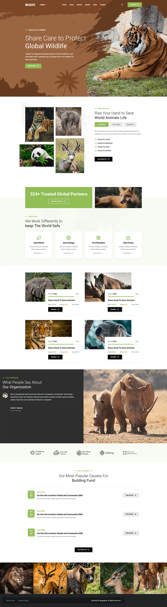

  <h1>Wildlife Care</h1>

  

    <strong>About the Project:</strong>
    Wildlife Care is a nonprofit-themed website built with React and Vite. It presents conservation services, donation campaigns, upcoming events, and partner organizations — all in a clean, responsive layout designed to inform and engage visitors.
  

  

    <strong>Key Highlights:</strong>
    Features a sticky header with smooth scroll behavior, interactive tabbed content, animated donation progress bars, and a fully responsive design across all screen sizes.
  

  
<h2>Project Details</h2>

  

    
<h4>What's Inside</h4>

    <ul>
      <li><strong>Header</strong> — Sticky navigation with language switcher and donation button.</li>
      <li><strong>Hero Section</strong> — Full-screen banner with headline, description, and CTA.</li>
      <li><strong>About Section</strong> — Tabbed content with mission, vision, and next plan.</li>
      <li><strong>CTA Section</strong> — Partner count highlight with a become-a-partner call to action.</li>
      <li><strong>Service Section</strong> — Four feature cards covering key conservation areas.</li>
      <li><strong>Donate Section</strong> — Campaign cards with progress bars, goals, and raised amounts.</li>
      <li><strong>Testimonial Section</strong> — Single quote with avatar, name, and role display.</li>
      <li><strong>Partner Section</strong> — Partner logos with hover color effect interaction.</li>
      <li><strong>Event Section</strong> — Date-based event cards with category and description.</li>
      <li><strong>Instagram Section</strong> — Horizontally scrollable image grid with hover overlay.</li>
      <li><strong>Footer</strong> — Footer links and copyright information in a clean layout.</li>
    </ul>
  

  

    
<h4>Key Features</h4>

    <ul>
      <li><strong>Sticky Header</strong> — Header changes background color on page scroll.</li>
      <li><strong>Mobile Navigation</strong> — Slide-in menu with open and close button controls.</li>
      <li><strong>Language Switcher</strong> — Dropdown to switch between English, French, and Spanish.</li>
      <li><strong>Tabbed Content</strong> — About section tabs switch between Mission, Vision, and Plan.</li>
      <li><strong>Donation Progress Bars</strong> — Each campaign shows raised amount, goal, and progress.</li>
      <li><strong>Partner Logo Hover</strong> — Logos switch from gray to color on hover interaction.</li>
      <li><strong>Centralized Data</strong> — All content managed from a single <code>content.json</code> file.</li>
      <li><strong>Fully Responsive</strong> — Layout adapts cleanly from mobile to large desktop screens.</li>
    </ul>
  

  

    
<h4>Technologies Used</h4>

    <ul>
      <li><strong>React</strong> — Component-based UI with hooks for state and side effects.</li>
      <li><strong>Vite</strong> — Fast development server and optimized production build tool.</li>
      <li><strong>CSS (Custom Properties)</strong> — Design tokens for colors, typography, and spacing.</li>
      <li><strong>Lucide React</strong> — Clean icon library used throughout the interface.</li>
      <li><strong>JSON (content.json)</strong> — Single file manages all section text and data.</li>
    </ul>
  

  

    
<h4>Project Structure</h4>

    <pre>
wildlife-care/
│
├── public/                      # Hero banners, about images, donation photos, event images, and more
│
├── src/
│   ├── App.jsx                  # Main component with all sections and state management
│   ├── content.json             # Centralized data for header, sections, and footer
│   ├── main.jsx                 # React DOM entry point
│   └── index.css                # Global styles with custom properties and media queries
│
├── index.html                   # HTML template with meta tags and font imports
├── package.json                 # Dependencies and build scripts
├── vite.config.js               # Vite build configuration
└── README.md                    # Project documentation
    </pre>
  

  
 
    
<h4>Quick Start</h4>

    <ol>
      <li>
        <strong>Clone the repository:</strong>
        <pre><code>git clone https://github.com/nawazdevx/wildlife-care.git</code></pre>
      </li>

      <li>
        <strong>Navigate to project folder:</strong>
        <pre><code>cd wildlife-care</code></pre>
      </li>

      <li>
        <strong>Install dependencies:</strong>
        <pre><code>npm install</code></pre>
      </li>

      <li>
        <strong>Start development server:</strong>
        <pre><code>npm run dev</code></pre>
        Then visit the local URL shown in terminal (usually <code>http://localhost:5173</code>)
      </li>

      <li>
        <strong>Build for production:</strong>
        <pre><code>npm run build</code></pre>
        Production files will be generated in <code>dist/</code> folder
      </li>
    </ol>

  

 
  <strong>License:</strong>
  This project is licensed under the <a href="https://choosealicense.com/licenses/mit/">MIT License</a>.

 
  <strong>Contact:</strong> 
  Connect with me on <a href="https://www.linkedin.com/in/nawazdevx">LinkedIn</a> or visit my <a href="https://nawazdevx.vercel.app/">Portfolio</a>.

 
  <strong>Support:</strong> 
  Found this helpful? Give it a ⭐ on GitHub! Thank you.

 

  <h2>Project Preview</h2>

  

    <strong>You can view the live project here ➜</strong>
    <a href="https://wildlife-nawazdevx.netlify.app/" target="_blank">
      <strong>Live Demo</strong>
    </a>
  

  

